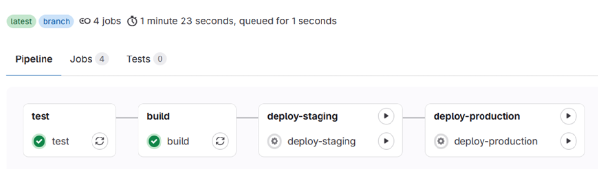
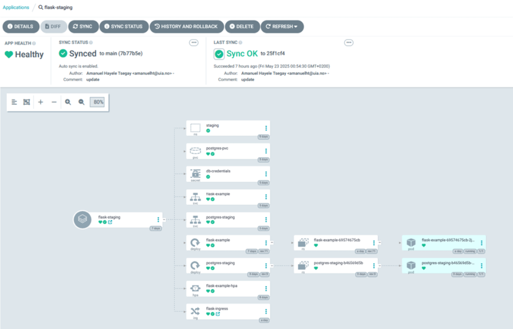
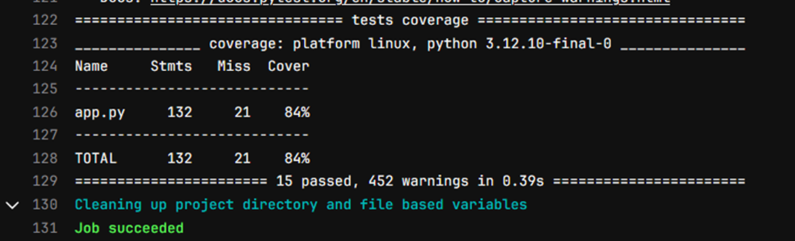

# DevOps Project
A complete **DevOps transformation project** for a Flask-based application, focusing on automation, scalability, and reliability.

---

## Overview

This project replaces a **manual and error-prone deployment workflow** with a modern DevOps pipeline.

### Before
- Manual deployments  
- Code pushed directly to `main`  
- No automated testing  
- No staging environment  
- No monitoring  

### After
- Git-based workflow with feature branches  
- Automated CI/CD pipelines  
- Kubernetes-based staging & production  
- GitOps deployment with ArgoCD  
- Monitoring with Grafana & Prometheus  

---

## Goal

To design and implement a **scalable, automated, and reliable DevOps workflow** that improves:

- Software quality  
- Deployment safety  
- Team collaboration  
- Observability  
- Delivery speed  

---
## What I Implemented

### CI/CD Pipeline
- GitLab CI/CD pipeline with stages:
  - Test (pytest + coverage)
  - Build (Kaniko)
  - Deploy (staging & production)
- Achieved **84% test coverage**
- Automatic validation on every push

---

### Containerization
- Docker multi-stage builds  
- Secure builds using **Kaniko**  
- Versioned images pushed to GitLab Container Registry  

---

### Kubernetes Deployment
- Separate environments:
  - `staging`
  - `production`
- Deployments, Services, and Ingress configured  
- Namespace-based isolation  

---

### Database Strategy
- SQLite (development)  
- PostgreSQL (staging & production)  

---

### GitOps with ArgoCD
- Continuous sync between Git and Kubernetes  
- Visual deployment state  
- Manual approval for production  

---

### Monitoring & Observability
- Prometheus for metrics  
- Grafana dashboards  
- Full system visibility  

---
## Architecture Overview

Feature Branch
↓
GitLab CI/CD
├── Test (pytest + coverage)
├── Build (Kaniko)
└── Push image to registry
↓
Kubernetes
├── Staging
└── Production
↓
ArgoCD (GitOps)
↓
Grafana + Prometheus

---

## Tech Stack

- GitLab CI/CD  
- Docker & Kaniko  
- Kubernetes  
- ArgoCD  
- Grafana & Prometheus  
- Python (Flask)  
- PostgreSQL & SQLite  
- Gunicorn  

---

## Key Results

-  84% test coverage  
-  Automated CI/CD pipeline  
-  Staging & production environments  
-  GitOps deployment  
-  Improved reliability  
-  Full observability  

---

This pipeline shows automated testing, image build, and controlled deployment.

---

ArgoCD ensures Kubernetes is always in sync with Git.

---

Automated testing with pytest and coverage integrated into CI/CD.

---

##  What I Learned

- CI/CD pipeline design  
- Kubernetes deployments  
- GitOps workflows  
- Infrastructure practices  
- Monitoring and observability  
- Production-ready DevOps workflows  

---

